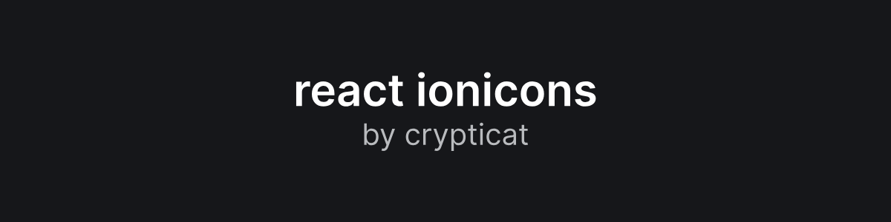

Lowkey the best ionicons library for react. It's up-to-date and fully typed in typescript, unlike `react-ionicons`. Full credit to the ionic team for creating [this amazing icon set!](http://ionicons.com/)

You might be looking for the [main crypticat documentation.](https://github.com/kognise/crypticat/blob/master/README.md)

## Usage

Just import any icon and use it as a react component!

```tsx
import ArrowBackOutline from '@crypticat/ionicons/lib/arrow-back-outline'

export default () => (
  <ArrowBackOutline />
)
```

## Features

- No dependencies
- Icons are inine svgs
- Standard html props
- Respects text color